# Spectra: An Enterprise SDLC GenAI Platform

Spectra is a powerful, offline-first, and extensible platform designed to bring the power of Generative AI to the enterprise Software Development Life Cycle (SDLC). It features a modular, agent-based architecture that allows for the integration of multiple specialized AI agents to assist with various development tasks.

## 🏗️ Architecture & Workflow

Spectra acts as the central AI nervous system for the SDLC, bridging the gap between developers, legacy knowledge, and modern tooling.

```mermaid
graph TD
    subgraph "Development Team"
        Developer["👩‍💻 Developer / Team"]
        SA["📐 Solution Architect"]
    end

    subgraph "Core AI System"
        AI_Agent["🤖 Spectra Platform<br>(Solvo, Sutra, Pramana)"]
    end

    subgraph "Project Context & Knowledge"
        KnowledgeBase["📚 Project Knowledge Base<br>(Vector DB: Existing Code,<br>Documentation, Requirements)"]
    end

    subgraph "SDLC Tools & Platforms"
        IDE["💻 IDE / Web Interface<br>(Streamlit)"]
        VCS["☁️ Version Control<br>(Git)"]
        CI_CD["🚀 CI/CD Pipeline<br>(Future Integration)"]
        ProjectMgmt["📋 Project Management<br>(Jira Integration)"]
    end

    subgraph "SDLC Phases (AI-Assisted)"
        Phase_Req["📝 Requirements (Solvo - DigitalOne PO)"]
        Phase_Design["🎨 Design (Solvo - Architect)"]
        Phase_Code["⌨️ Coding (Sutra)"]
        Phase_Test["🧪 Testing (Pramana)"]
        Phase_Deploy["🚢 Deployment (Setu)"]
        Phase_Maintain["🛠️ Maintenance (Custos)"]
    end

    %% Interactions
    Developer -- "Queries, Code Reviews" --> AI_Agent
    SA -- "Requirements, Scoping" --> AI_Agent
    AI_Agent -- "Impact Analysis, Code, Backlogs" --> SA
    AI_Agent -- "Code, Test Cases" --> Developer
    
    %% AI Agent Core Interactions
    AI_Agent -- "Retrieves Context (RAG)" --> KnowledgeBase
    KnowledgeBase -- "Provides Hybrid Context" --> AI_Agent
    AI_Agent -- "Serves UI" --> IDE
    AI_Agent -- "Reads/Indexes" --> VCS
    AI_Agent -- "Updates Stories" --> ProjectMgmt

    %% AI Agent Assisting in SDLC Phases
    AI_Agent --> Phase_Req
    AI_Agent --> Phase_Design
    AI_Agent --> Phase_Code
    AI_Agent --> Phase_Test
    AI_Agent --> Phase_Deploy
    AI_Agent --> Phase_Maintain

    %% Styling
    classDef default fill:#f9f9f9,stroke:#333,stroke-width:2px;
    classDef phase fill:#e6f3ff,stroke:#007bff,stroke-width:2px;
    classDef tool fill:#fff2cc,stroke:#ffc107,stroke-width:2px;
    classDef ai fill:#e6ffe6,stroke:#28a745,stroke-width:2px;
    classDef dev fill:#ffe6e6,stroke:#dc3545,stroke-width:2px;
    classDef kb fill:#f0e6ff,stroke:#6f42c1,stroke-width:2px;

    class AI_Agent ai;
    class Developer,SA dev;
    class KnowledgeBase kb;
    class Phase_Req,Phase_Design,Phase_Code,Phase_Test,Phase_Deploy,Phase_Maintain phase;
    class IDE,VCS,CI_CD,ProjectMgmt tool;
```



## Features

- **Configuration-Driven Architecture**: One platform, multiple product workflows ("Profiles").
    - **Ensemble (Legacy)**: Code-driven analysis for Java/COBOL/Pro*C.
    - **DigitalOne (Modern)**: Documentation-driven analysis for Product Owners.
- **Agent-Based Architecture**: Specialized AI agents tailored for specific SDLC tasks.
- **Offline-First**: Designed for secure, air-gapped enterprise environments.
- **Retrieval-Augmented Generation (RAG)**: Uses your private codebases and documentation as a knowledge base.
- **Advanced Indexing**:
    - **Streaming Upload**: Efficiently indexes massive codebases.
    - **Language Detection**: Smart parsing for C, Python, Java, COBOL, Shell, and more.
    - **Hybrid Search**: Combines semantic understanding with exact keyword matching.
- **Multi-User Secure Platform**:
    - **User Authentication**: Secure login and registration.
    - **Isolated Sessions**: Private session history per user.
    - **Session Management**: Save/Load analysis sessions.

---

## 🏗️ The Spectra Agent Ecosystem

Spectra is designed as a collaborative swarm of specialized agents. We are currently in Phase 3.

### 🤖 Solvo ("I Solve" - Latin) - The AI Solution Architect & PO

**Solvo** adapts its behavior based on the selected profile:

*   **Mode: Architect (Ensemble Profile)**
    *   **Function**: Analyzes code and requirements to generate technical design documents.
    *   **Context**: Deep code inspection (Java, COBOL).
    *   **Output**: Impact Analysis, Code Diffs, Technical Specs (.docx).

*   **Mode: Product Owner (DigitalOne Profile)**
    *   **Function**: Analyzes business requirements to create agile backlogs.
    *   **Context**: Documentation-only (Functional Specs, User Guides).
    *   **Capabilities**:
        *   `/requirement-analysis`: Gap analysis against OOB capabilities.
        *   `/scope-impact-analysis`: System integration and scope definition.
        *   `/epic-feature-userstory`: Breakdown into Jira-ready stories.

### 🧵 Sutra ("The Thread" - Sanskrit) - The AI Senior Developer

**Sutra** acts as an expert AI software developer.

- **Function**: Takes a technical design or impact analysis and generates production-ready code.
- **Output**: Complete code blocks and file modifications formatted as JSON.

### ⚖️ Pramana ("The Proof" - Sanskrit) - The AI QA Engineer

**Pramana** acts as an expert QA automation engineer.

- **Function**: Generates rigorous test harnesses to validate Sutra's work against Solvo's requirements.
- **Output**: Unit Tests (JUnit/PyTest), Integration Scenarios, Regression Suites.

---

## Getting Started

### 1. Prerequisites

- **Python**: Version 3.11.
- **Git**: For cloning the repository and local codebases.
- **Ollama**: For running the local Large Language Model (LLM).
  - [Download and install Ollama](https://ollama.com/).
  - After installing, pull a model to serve as the agent's "brain." We recommend `llama3:8b` for a good balance of performance and resource usage.
    ```bash
    ollama pull llama3:8b
    ```
- **LLM**: 
  - **Setup**: 

### 2. Initial Setup

Clone the repository and install the required Python packages.

```bash
# Clone the repository
git clone 
cd Spectra

# Create a Python virtual environment
python -m venv venv

# Activate the virtual environment
# Linux/macOS:
source venv/bin/activate
# Windows:
.\venv\Scripts\activate

# Install the dependencies
pip install -r requirements.txt
```

### 3. Create a Knowledge Base

The agents need a knowledge base to work with. The `indexer.py` script is used to create one from a local or Git repository codebase.

1.  **Run the Indexer**:
    ```bash
    python interfaces/cli/indexer_cli.py
    ```
2.  **Follow the Prompts**: The script will interactively ask you for:
    - The path to a new or existing vector database.
    - A name for your collection (e.g., the name of the codebase).
    - The source of the code (a local folder or a Git URL).

The indexer will process the codebase, create embeddings, and save them to the local vector database. You can create multiple knowledge bases for different projects.

### 4. Running the Web Interface

Once the setup is complete and you have created at least one knowledge base, you can start the web application.

```bash
streamlit run interfaces/web/app.py
```

1.  **Login**: Register a user account.
2.  **Select Profile**:
    *   **Ensemble**: For code-heavy technical analysis.
    *   **DigitalOne**: For requirement-heavy product analysis.
3.  **Select Agent**: Solvo, Sutra, or Pramana.
4.  **Start Working**: Use natural language or slash commands (e.g., `/requirement-analysis`).

---

## 🔮 Roadmap & Future Work

### 🛠️ Architecture: Production Hardening
To ensure robustness, scalability, and handling of long-running tasks in a multi-user enterprise environment, the following architectural upgrades are planned:

#### Phase 1: Dockerize the Current Monolith
- **Goal**: Eliminate environment inconsistencies and simplify deployment on Windows Server.
- **Tasks**:
  - Create a `Dockerfile` for the application.
  - Use `docker-compose` to manage services and mount persistent volumes (`data/`, `config/`).

#### Phase 2: Async Job Queue (The "Offline" Fix)
- **Goal**: Handle long-running analysis tasks without browser timeouts or blocking the UI.
- **Tasks**:
  - Implement a persistent job queue (SQLite-based or Huey) to replace simple threading.
  - Create a "Jobs" view in the UI to track status and retrieve results asynchronously.
  - Enable "fire-and-forget" workflows.

#### Phase 3: Decoupled Client-Server Architecture
- **Goal**: True enterprise scalability separating the "Brain" from the "Face".
- **Tasks**:
  - **Backend**: Extract Agent logic into a **FastAPI** service (loads models once globally).
  - **Frontend**: Refactor Streamlit to act as a lightweight client consuming the API.
  - **Worker**: Dedicated worker processes for executing AI tasks.

### 🔌 Upcoming Features
- **Direct Ollama Integration**: Add a direct Ollama integration as an alternative to the AI Framework for users without access to it.

### 🔮 Future Agents
The following agents are planned for future releases to complete the autonomous SDLC loop.

- **🛡️ Custos ("The Guardian" - Latin)** - Phase 4: The Guardian (Planned Q2)
    - Role: DevSecOps & Security Compliance.
    - Function: The shield of the platform. Scans code and artifacts for vulnerabilities, ensuring zero-trust security and GDPR compliance before deployment.
    - Output: Security Audit Reports, SAST/DAST Analysis, Vulnerability Patches.

- **🌉 Setu ("The Bridge" - Sanskrit)** - Phase 5: The Bridge (Planned Q3)
    - Role: Release Manager & DevOps.
    - Function: The bridge to production. Manages the safe passage of code from the repository to the live environment.
    - Output: CI/CD Pipelines, Kubernetes Manifests, Release Notes.
